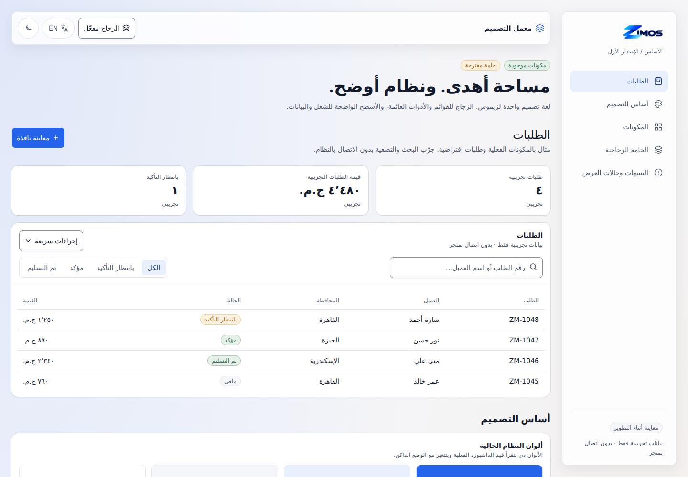
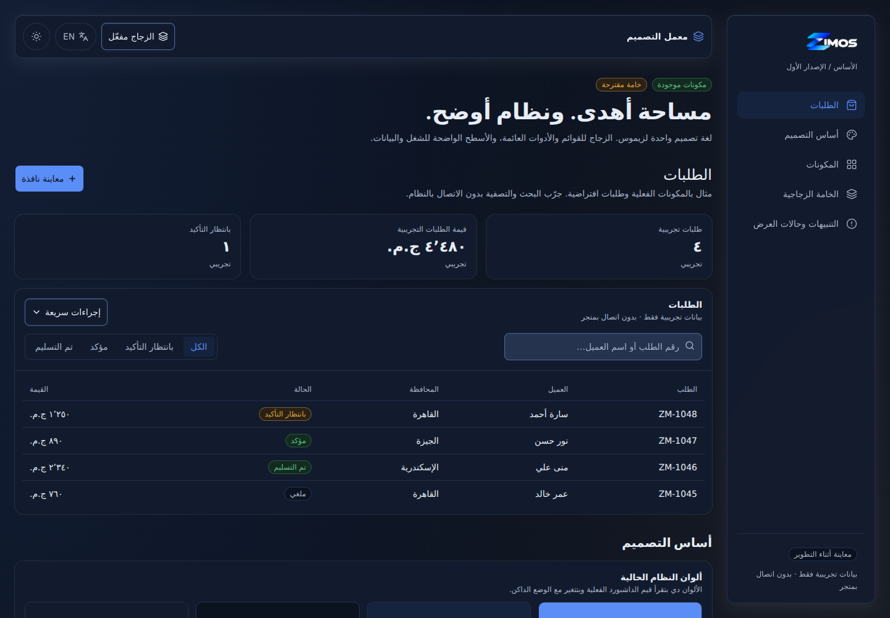
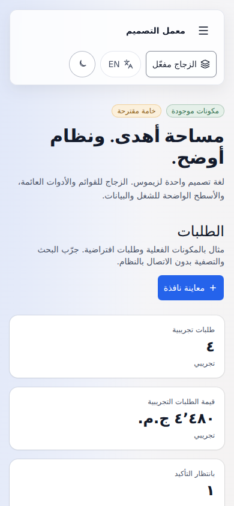

# ZIMOS UI lab preview

Development entry: `/design-system` in `apps/merchant-dashboard`.
See [UI_SYSTEM](../UI_SYSTEM.md) for startup and Claude handoff;
[UI_RULES](../UI_RULES.md) contains the agent rules.

## Preview captures

Arabic / light / 1440 × 1000:

Arabic / dark / 1440 × 1000:

Arabic / light / 390 × 844:

## Verification — 2026-10-04

- `npx tsc -b`: merchant-dashboard and platform-admin passed.
- `npm run build:dashboard`: passed. The application still reports large
  production chunks (>500 KB); that broader bundle work is outside this slice.
- Used the lab in headless Chromium: English/LTR and Arabic/RTL, light/dark,
  desktop and 390px mobile. Inspected these captures visually.
- Search, no-results reset, status filter, menu action and local toast worked.
- Dialog received focus, contained repeated Tab navigation, closed with
  Escape and restored trigger focus. Native invalid-email validation kept
  it open; valid form submission closed it and displayed local feedback.
- Loading, empty, error and no-permission states displayed; permission state
  did not expose a retry action.
- Glass-off applied to the shell **and portalled dialog**. Reduced-motion
  emulation stopped the skeleton animation. No horizontal page overflow at
  390px; mobile navigation opened/closed and dialog stayed within the viewport.
- No browser runtime errors or backend API requests in the development lab.
- Production preview at `/design-system` rendered the existing sign-in flow,
  with no lab. The lab import/content is absent from the production JS output.
- No test suites were run or added, following the repository lane contract.

The material's soft text has a calculated worst-backdrop contrast bound of
5.23:1 light / 6.58:1 dark at the chosen fill opacity, assuming the declared
opaque host tokens and the sRGB alpha composition in `styles.css`. This is a
bound for the material's text pair, not an accessibility audit of every
existing component or a browser measurement of every rendered pixel.

Real-device performance, cross-browser/Safari rendering and any production
AppShell adoption remain to be reviewed. The existing shared ThemeToggle
still has English accessible labels in Arabic; see UI_SYSTEM for follow-ups.
